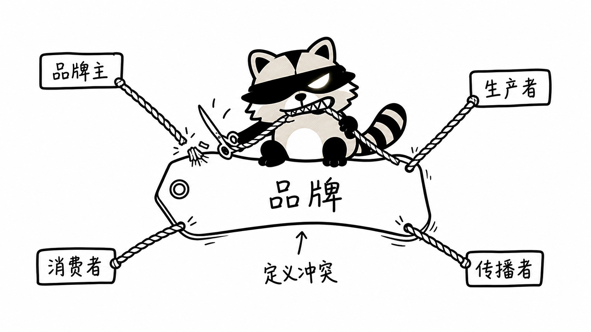
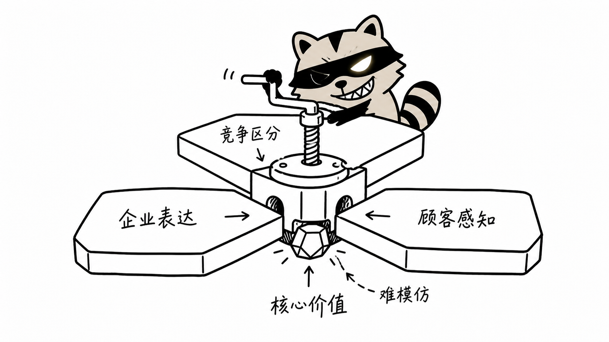

# RaBrat Illustrations 使用说明书


## 1. 这个 Skill 用来做什么

`rabrat-illustrations` 用来把文章、方法论、SOP、工作流和抽象观点，转成带有 RaBrat 浣熊角色的正文配图。

它适合：

- 中文文章正文配图
- 方法论解释图
- 工作流隐喻图
- 研究过程图
- 品牌、产品、运营、知识管理类内容

## 2. RaBrat 是什么形象

RaBrat 是一只狡诈聪明的浣熊知识工：

- 只露出一只眼睛
- 另一只眼睛被黑色面罩或眼罩遮住
- 黑色盗贼面罩
- 锯齿尖牙坏笑
- 条纹尾巴
- 像幕后操盘手，而不是可爱吉祥物

最重要的提示词是：

```text
exactly one visible eye, the other eye completely covered by a black mask or eyepatch
```

## 3. 推荐工作流

### 先出 shot list

```text
Use $rabrat-illustrations. 请分析这篇文章适合在哪里配图，输出 5 张 shot list，先不要生图。
```

### 再生成图片

```text
Use $rabrat-illustrations. 按刚才的 shot list 生成 4 张正文配图。
```

## 4. 常用构图

### 分拣机

适合资料筛选、扎根编码、内容整理。


### 绳子拉扯

适合定义冲突、多主体博弈、观点分歧。



### 压榨机

适合核心价值、洞察提炼、复杂输入压缩成一个判断。



### 千斤顶支撑

适合说明某个系统需要管理、机制或策略持续维系。


## 5. 质量检查

生成后检查：

- 是否只有一只眼睛可见？
- 另一只眼睛是否被黑色面罩/眼罩遮住？
- 是否有锯齿尖牙和坏笑？
- 是否像狡诈聪明的知识工？
- 是否只表达一个核心意思？
- 是否避免了 PPT 流程图感？
- 中文标签是否短而可读？

如果出现两只眼睛、太可爱、太写实、标签太多，就重生成。

## 6. 示例 Prompt

```text
Generate one standalone 16:9 horizontal Chinese article illustration.

Character:
A reusable article-illustration raccoon character named RaBrat. Big rounded head, thick black outline, beige-gray face and body, black paws, small rounded ears, striped tail, bold black bandit mask. Critical face detail: exactly one eye is visible, sharp and bright under the mask; the other eye is completely covered by a black eye patch or black mask area. Do not show two eyes. Sly sideways grin with visible jagged triangular teeth. Personality: cunning, clever, strategic, mischievous, slightly villainous but funny, like a smart trickster knowledge worker.

Theme:
4895条品牌资料被扎根编码筛选成结构。

Scene:
RaBrat stands beside a strange hand-cranked sorting machine and turns the crank. Paper scraps labeled 官网、微博、论坛、新闻 enter the machine. Boxes labeled 符号、对象、价值、活动 come out. A small trash bin is labeled 噪音.
```
